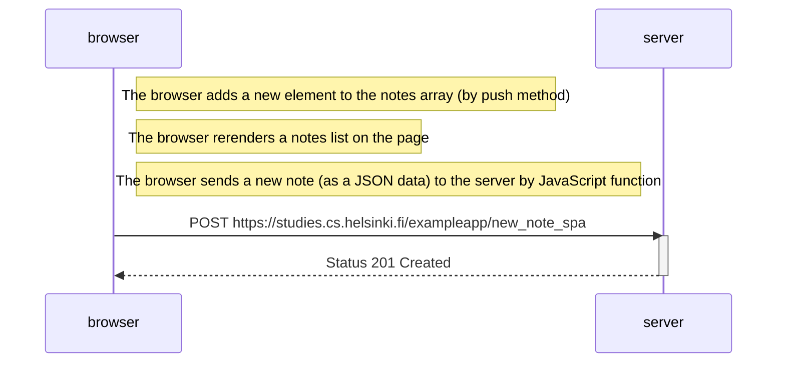

```mermaid
sequenceDiagram
    participant browser
    participant server

    Note right of browser: The browser adds a new element to the notes array (by push method)
    Note right of browser: The browser rerenders a notes list on the page
    Note right of browser: The browser sends a new note (as a JSON data) to the server by JavaScript function
    browser->>server: POST https://studies.cs.helsinki.fi/exampleapp/new_note_spa
    activate server
    server-->>browser: Status 201 Created
    deactivate server


```